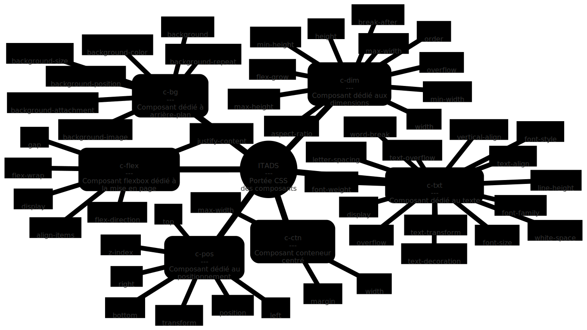
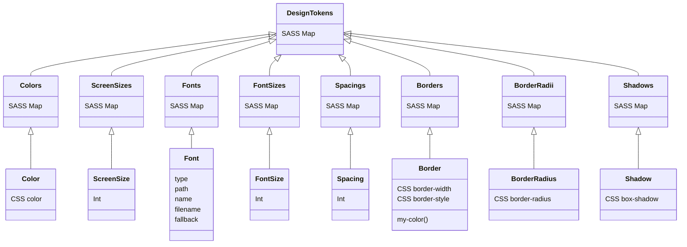

# ITADS

Présentation et généralités du système de design de IT Automotive

## C'est quoi un Design System ?

> Développer des sites et applications en utilisant des composants prêts à l'emploi, accessibles et ergonomiques <br><sub>[Source : Système de Design du Gouvernement](https://www.systeme-de-design.gouv.fr/)</sub>

Des exemples de Design Systems [https://designsystemsrepo.com/](https://designsystemsrepo.com/)

## [CSS] Généralités

Le framework UI CSS s'appelle **briks.scss** et permet de générer des fichiers composants CSS. Les composants CSS sont placés dans des dépôts indépendants à partir de l'organisation [ITADS](https://github.com/orgs/ita-design-system/)

### [CSS] Méthodologie

La méthodologie utilisée est une hybridation de [Atomic Design](https://bradfrost.com/blog/post/atomic-web-design/), [BEM](https://getbem.com/) comme [Bootstrap](https://getbootstrap.com/) et Utility first comme [Tailwind.css](https://tailwindcss.com/). Les grands principes sont :

* **Pas de HTML associé** : chaque classe CSS n'est associée ni à une balise, ni à une arborescence HTML. 
* **Pas d'héritage** : Sauf exceptions, les sélecteurs n'utilisent pas l'héritage mais affectent uniquement les propriétés de l'élément spécifié.

### [CSS] Composant



Un composant `c-` ou `my-` est une classe CSS qui contient zéro ou plusieurs propriétés CSS. Le composant peut affecter des [pseudo-classes](https://developer.mozilla.org/fr/docs/Web/CSS/Pseudo-classes) et des [pseudo-éléments](https://developer.mozilla.org/fr/docs/Web/CSS/Pseudo-elements). Le nom de cette classe est composé d'un préfixe et d'un nom, souvent abrégé, qui désigne une fonctionnalité. Exemples : 
* `c-txt` n'applique aucune propriété sur l'élément spécifié.
  * `c-` : préfixe composant.
  * `txt` : nom du composant dédié au texte.
* `c-flex` applique uniquement la propriété `display: flex` sur l'élément spécifié.
  * `c-` : préfixe composant.
  * `flex` : nom du composant de grille.
* `c-btn` applique de multiples propriétés sur l'élément spécifié.
  * `c-` : préfixe composant.
  * `btn` : nom du composant bouton.

### [CSS] Modifieur

Un modifieur `m-` ou `mod-` est directement associé à un composant. Il n'a aucun effet s'il est utilisé seul. C'est une classe CSS qui vient ajouter ou surcharger une ou plusieurs propriétés CSS à son composant. Le modifieur peut affecter des [pseudo-classes](https://developer.mozilla.org/fr/docs/Web/CSS/Pseudo-classes) et des [pseudo-éléments](https://developer.mozilla.org/fr/docs/Web/CSS/Pseudo-elements). Le nom de cette classe est composé d'un préfixe `m-` et d'un nom, un abrégé qui désigne la ou les propriétés qu'il affecte (`ta-` pour text-align par ex.) et la valeur (`center` par ex.). Exemples :
* Le modifieur `m-main-space-between` associé à son composant `c-flex` applique la propriété `justify-content: space-between`. `m-main-space-between` appliqué seul n'a aucun effet.
  * `m-` : préfixe modifieur
  * `main-` : nom de la propriété affectée (ici l'axe main `justify-content` du composabnt flex)
  * `space-between` : valeur associée (`space-between`).
* Le modifieur `m-ta-center` associé à son composant `c-txt` applique la propriété `text-align: center`. `m-ta-center` appliqué seul n'a aucun effet.
  * `m-` : préfixe modifieur
  * `ta-` : nom de la propriété affectée
  * `center` : valeur associée (`center`).

### [CSS] Utilitaire

Un utilitaire `u-`est une classe qui affecte une et une seule propriété en la surchargeant (si elle est déjà définie) et en forçant son usage. L'utilitaire peut affecter des [pseudo-classes](https://developer.mozilla.org/fr/docs/Web/CSS/Pseudo-classes) et des [pseudo-éléments](https://developer.mozilla.org/fr/docs/Web/CSS/Pseudo-elements). Le nom de cette classe est composé d'un préfixe et d'un nom, souvent abrégé, qui désigne la fonctionnalité du modifieur. Exemples :
* L'utilitaire `u-bc-primary-500` applique et force la propriété `background-color` à la valeur associée à `primary-500`.
  * `u-` : préfixe utilitaire.
  * `bc-` : nom de la propriété affectée.
  * `primary-500` : nom de la valeur
* L'utilitaire `u-ta-center` applique et force la propriété `text-align` à la valeur associée à `center`.
  * `u-` : préfixe utilitaire.
  * `ta-` : nom de la propriété affectée.
  * `center` : nom de la valeur.

## [TOKENS] Design tokens

Les fondamentaux, également appelés *design tokens*, sont les parties élémentaires indivisibles du Design System à partir desquelles les composants, modifieurs et utilitaires sont créés.




### [TOKENS] Couleurs

Le nombre de couleurs est illimité mais il doit respecter les règles suivantes&nbsp;: les couleurs s'organisent en familles, une famille de couleurs complète doit contenir 9 nuances de la plus sombre à la plus claire comme dans l'exemple ci-dessous. *Important&nbsp;: plus le nombre de familles de couleurs est élevé, plus les performances du framework sont impactées.*

La couleur principale de chaque famille est représentée par la **convention de désignation `<NOM_DE_LA_COULEUR>-500`**. Les valeurs abstraites `-400`, `-300`, `-200` et `-100` sont les nuances sombres de la couleur principale et les valeurs `-600`, `-700`, `-800` et `-900` sont des nuances plus claires.

* `<NOM_DE_LA_COULEUR>-100` nuance la plus sombre 
* `<NOM_DE_LA_COULEUR>-200` nuance sombre 
* `<NOM_DE_LA_COULEUR>-300` nuance sombre 
* `<NOM_DE_LA_COULEUR>-400` nuance sombre 
* **`<NOM_DE_LA_COULEUR>-500` couleur principale**
* `<NOM_DE_LA_COULEUR>-600` nuance claire
* `<NOM_DE_LA_COULEUR>-700` nuance claire 
* `<NOM_DE_LA_COULEUR>-800` nuance claire 
* `<NOM_DE_LA_COULEUR>-900` nuance la plus claire 

| Nom de la famille | Nuance | Token | Variable CSS |
|:-|:-|:-|:-|
| primary | 100 | `primary-100` | `--ita-color-primary-100` |
| primary | 200 | `primary-200` | `--ita-color-primary-200` |
| primary | 300 | `primary-300` | `--ita-color-primary-300` |
| primary | 400 | `primary-400` | `--ita-color-primary-400` |
| **primary** | **500** | **`primary-500`** | **`--ita-color-primary-500`** |
| primary | 600 | `primary-600` | `--ita-color-primary-600` |
| primary | 700 | `primary-700` | `--ita-color-primary-700` |
| primary | 800 | `primary-800` | `--ita-color-primary-800` |
| primary | 900 | `primary-900` | `--ita-color-primary-900` |
| neutral | 100 | `neutral-100` | `--ita-color-neutral-100` |
| neutral | 200 | `neutral-200` | `--ita-color-neutral-200` |
| neutral | 300 | `neutral-300` | `--ita-color-neutral-300` |
| neutral | 400 | `neutral-400` | `--ita-color-neutral-400` |
| **neutral** | **500** | **`neutral-500`** | **`--ita-color-neutral-500`** |
| neutral | 600 | `neutral-600` | `--ita-color-neutral-600` |
| neutral | 700 | `neutral-700` | `--ita-color-neutral-700` |
| neutral | 800 | `neutral-800` | `--ita-color-neutral-800` |
| neutral | 900 | `neutral-900` | `--ita-color-neutral-900` |

Exemple de table de couleurs valide


Exemple de table de couleurs invalide


### [TOKENS] Espacements

Les espacements sont utilisés dans les marges, les positionnements ainsi que de nombreux composants, modifieurs et uttilitaires. Le nombre d'espacements doit respecter une échelle d'incréments désignés comme suit. *Important&nbsp;: plus le nombre d'espacements est élevé, plus les performances du framework sont impactées.*

Les espacements sont classés par ordre croissant et nommés par une **convention de désignation sous forme d'index `<0 à n>` -> `<VALEUR>`**. 

* L'espacement `0` -> `0px` est réservé à l'équipe de développement front-end du ITADS, il n'est pas demandé au client. 
* `1` désigne l'espacement le plus petit fourni par le client.
* `n` désigne le plus grand espacement fourni par le client. 
* `n - 1` correspond à un espacement toujours plus petit que `n`.
* **`<VALEUR>`** chaîne de caractères définissant une longueur dans une unité CSS valide.

Exemple de table d'espacements valides, les différentes valeurs sont fournies par le client.

| Index / nom de l'espacement | Valeur |
|:-|:-|
| 14 | 112px |
| 13 | 96px |
| 12 | 80px |
| 11 | 64px |
| 10 | 56px |
| 9 | 48px |
| 8 | 40px |
| 7 | 32px |
| 6 | 24px |
| 5 | 20px |
| 4 | 16px |
| 3 | 12px |
| 2 | 8px |
| 1 | 4px |
| **0** <sup>1</sup> | **0px** <sup>1</sup> |

<sub>(1) L'espacement `0` -> `0px` est réservé à l'équipe de développement front-end du ITADS, il n'est pas demandé au client. <sub>

### [TOKENS] Polices de caractères

Une police de caractères est un ensemble de styles composé de 1 à 9 variations de graisses qui peuvent chacune être déclinées en italique. Une police de caractères peut donc regrouper 1 à 18 styles. 1 style = 1 graisse + italique oui ou non. Le nombre de polices de caractères est illimité, cependant *il est important de noter que plus le nombre de polices est élevé, plus les performances du framework sont impactées.* 

La convention d'appellation du design token pour une police de caractère est la suivante&nbsp;: **`<NOM_D_USAGE>-<GRAISSE>(-i)`**

* **Le `<NOM_D_USAGE>` est défini par l'équipe de développement, il doit être explicite par rapport à la fonction typographique qu'il occupe au sein du Design System.**
* **La `<GRAISSE>` de la police est définie sous forme de centaine comme dans le tableau de correspondance ci-dessous.**
* **-i est ajouté au design token si la police de caractère est italique**

Tableau d'équivalences nom des graisses / centaines CSS `font-weight`.

| Nom de la graisse | Équivalent en centaine CSS `font-weight` |
|:-|:-:|
| Thin | 100 |
| Extra-light | 200 |
| Light | 300 |
| Normal, ou regular | 400 |
| Medium | 500 |
| Semi-bold | 600 |
| Bold | 700 |
| Extra-bold | 800 |
| Black | 900 |

On différencie le nom d'usage du nom de la police afin d'éviter les écueils en cas de changement de police de caractères.

Par exemple `<NOM_D_USAGE>` est `lead` (personnalisation de l'équipe de développement) et `<NOM_DE_LA_POLICE>` est `Montserrat`. Si un jour la police lead doit être changée, sa fonction reste la même empêche la confusion au sein du Design System.

Par exemple pour une police dont le nom est "Montserrat Thin 100 Italic", on utilise un nom d'usage différent du nom de la police, par exemple "lead"

Exemple de design tokens de polices&nbsp;:

| Nom de la police | Nom d'usage | Graisse | Italique | Design token | Variable CSS |
|:-|:-|:-|:-|:-|:-|
| Montserrat | lead | Thin | non | `lead-100` | `--ita-font-family-lead-100` |
| Montserrat | lead | Light | non | `lead-300` | `--ita-font-family-lead-300` |
| Montserrat | lead | Regular | non | `lead-400` | `--ita-font-family-lead-400` |
| Montserrat | lead | Regular | oui | `lead-400-i` | `--ita-font-family-lead-400-i` |
| Montserrat | lead | Semi-bold | non | `lead-600` | `--ita-font-family-lead-600` |
| Montserrat | lead | Bold | non | `lead-700` | `--ita-font-family-lead-700` |
| Montserrat | lead | Black | non | `lead-900` | `--ita-font-family-lead-900` |
| Montserrat | lead | Black | oui | `lead-900-i` | `--ita-font-family-lead-900-i` |

Autre exemple de design tokens de polices&nbsp;:

| Nom de la police | Nom d'usage | Graisse | Italique | Design token | Variable CSS |
|:-|:-|:-|:-|:-|:-|
| Open Sans | lead | Regular | non | `lead-400` | `--ita-font-family-lead-400` |
| Open Sans | lead | Semi-bold | non | `lead-600` | `--ita-font-family-lead-600` |
| Open Sans | headline | Bold | non | `headline-700` | `--ita-font-family-headline-700` |
| Montserrat | headline | Black | non | `headline-900` | `--ita-font-family-headline-900` |
| Montserrat | headline | Black | oui | `headline-900-i` | `--ita-font-family-headline-900-i` |

### [TOKENS] Tailles de texte

Affectations de la taille des éléments textuels de type inline, principalement `font-size`. Le nombre de tailles de texte doit respecter une échelle d'incréments désignés comme suit. *Important&nbsp;: plus le nombre de tailles de texte est élevé, plus les performances du framework sont impactées.*

Les tailles de texte sont classés par ordre croissant et nommées par une **convention de désignation sous forme d'index `<1 à n>`**. 

* `1` désigne la taille de texte la plus petite fournie par le client.
* `n` désigne la plus grande tailler de texte fournie par le client. 
* `n - 1` correspond à une taille de texte toujours plus petite que `n`.

Exemple de tableau de correspondance de tailles de texte valides, les différentes valeurs sont fournies par le client.

| Index / nom de la taille de texte | Valeur | Variable CSS |
|:-|:-|:-|
| 15 | 60px | `--ita-font-size-15` |
| 14 | 54px | `--ita-font-size-14` |
| 13 | 48px | `--ita-font-size-13` |
| 12 | 42px | `--ita-font-size-12` |
| 11 | 36px | `--ita-font-size-11` |
| 10 | 32px | `--ita-font-size-10` |
| 9 | 28px | `--ita-font-size-9` |
| 8 | 24px | `--ita-font-size-8` |
| 7 | 20px | `--ita-font-size-7` |
| 6 | 18px | `--ita-font-size-6` |
| 5 | 16px | `--ita-font-size-5` |
| 4 | 14px | `--ita-font-size-4` |
| 3 | 12px | `--ita-font-size-3` |
| 2 | 10px | `--ita-font-size-2` |
| 1 | 8px | `--ita-font-size-1` |

### [TOKENS] Points de rupture

Également appelés "breakpoints" ou sous l'appellation "screen size", ils sont à base du design adaptif ou "responsive". Les points de ruptures sont des design tokens, des noms personnalisés associés à des valeurs qui forment des intervalles entre lesquels les composants, modifieurs et utilitaires peuvent se comporter différemment. Ils sont directement liés à la taille du terminal de l'utilisateur. 

Le nombre de points de rupture n'est pas limité. *Cependant, plus le nombre de points de rupture est élevé, plus les performances du framework sont impactées.*

Les points de rupture sont nommés selon une **convention de désignation `<NOM_DU_POINT_DE_RUPTURE>` -> `<valeur>`**. 

Exemple de tableau de correspondance de points de rupture

| Nom du point de rupture | Intervalle affecté |
|:-|:-|
| xs | de 0 à 608 px |
| sm | de 608 px à 896 px |
| md | de 896 px à 1288 px |
| lg | de 1288 px à 1576 px |
| xl | de 1576 px à l'infini |


### [TOKENS] Bordures

Une bordure est définie par une épaisseur de trait, un type de trait et une couleur. Les bordures sont classées par ordre croissant de visibilité selon une **convention de désignation sous forme d'index `<1 à n>`**. *Important&nbsp;: plus le nombre de bordures est élevé, plus les performances du framework sont impactées.*

* L'épaisseur désigne la valeur CSS [border-width](https://developer.mozilla.org/fr/docs/Web/CSS/border-width).
* Le trait désigne la valeur CSS [border-style](https://developer.mozilla.org/fr/docs/Web/CSS/border-style).
* La couleur de la bordure est un [design token couleur](#tokens-couleurs).
* `1` désigne la bordure la moins visible fournie par le client.
* `n` désigne la bordure la plus visible fournie par le client. 
* `n - 1` correspond à une bordure moins visible que `n`.

Exemple de tableau de correspondance de bordures valides, les différentes valeurs sont fournies par le client.

| Index / nom de la bordure | Épaisseur | Trait | Token couleur | Variable CSS |
|:-|:-|:-|:-|:-|
| **0** <sup>1</sup> | **0px** <sup>1</sup> | - | - | `--ita-border-0` <sup>1</sup> |
| 1 | 1px | solid | transparent-800 | `--ita-border-1` |
| 2 | 1px | solid | transparent-500 | `--ita-border-2` |
| 3 | 1px | dashed | neutral-500 | `--ita-border-3` |
| 4 | 1px | solid | neutral-900 | `--ita-border-4` |
| 5 | 1px | solid | neutral-500 | `--ita-border-5` |
| 6 | 1px | solid | primary-500 | `--ita-border-6` |
| 7 | 1px | solid | support-success-500 | `--ita-border-7` |
| 8 | 1px | solid | support-warning-500 | `--ita-border-8` |
| 9 | 1px | solid | support-danger-500 | `--ita-border-9` |
| 10 | 1px | solid | neutral-200 | `--ita-border-10` |
| 11 | 2px | solid | neutral-900 | `--ita-border-11` |
| 12 | 2px | solid | neutral-500 | `--ita-border-12` |
| 13 | 2px | solid | neutral-200 | `--ita-border-13` |
| 14 | 3px | solid | neutral-500 | `--ita-border-14` |
| 15 | 3px | solid | primary-500 | `--ita-border-15` |
| 16 | 3px | double | neutral-500 | `--ita-border-16` |

<sub>(1)</sub> Le token `--ita-border-0` est réservé au ITADS. Le client ne doit pas fournir de design token dont l'épaisseur est nulle.

### [TOKENS] Coins arrondis

Un coin arrondi est défini par un ou deux rayons de courbure. Le nombre de coins arrondis n'est pas limité. *Cependant, plus le nombre de coins arrondis est élevé, plus les performances du framework sont impactées.* Les différentes valeurs/combinaisons de valeurs sont fournies par le client.

Les coins arrondis sont classés par ordre croissant et nommés par une **convention de désignation sous forme d'index `<0 à n>` -> `<VALEUR>`**. 

* Le coin arrondi `0` -> `0px` est réservé à l'équipe de développement front-end du ITADS, il n'est pas demandé au client. 
* `1` désigne le coin arrondi le plus petit fourni par le client.
* `n` désigne le plus grand coin arrondi fourni par le client. 
* `n - 1` correspond à un coin arrondi toujours plus petit que `n`.
* **`<VALEUR>`** chaîne de caractères directement liée à la valeur CSS comme décrite sur [cette page](https://developer.mozilla.org/fr/docs/Web/CSS/border-top-left-radius) et fournie par le client. Par exemple `10px`, `20%`, `15px 20%`.

Exemple de table coins arrondus valides, les différentes valeurs sont fournies par le client.

| Index / nom de l'arrondi | Valeur | Variable CSS |
|:-|:-|:-|
| 4 | 64px | `--ita-border-radius-4` |
| 3 | 32px | `--ita-border-radius-3` |
| 2 | 8px | `--ita-border-radius-2` |
| 1 | 4px | `--ita-border-radius-1` |
| **0** <sup>1</sup> | **0px** <sup>1</sup> | `--ita-border-radius-0` |

<sub>(1) Le coin arrondi `0` -> `0px` est réservé à l'équipe de développement front-end du ITADS, il n'est pas demandé au client. <sub>

### [TOKENS] Ombres portées ou Élévation

Également appelées **élévation**, les ombres portées sont de simples abstractions de la propriété CSS `box-shadow`. Le nombre d'ombres portées n'est pas limité. *Cependant, plus le nombre d'ombres portées est élevé, plus les performances du framework sont impactées.* Les valeurs des ombres portées sont fournies par le client.

Les ombres portées sont classées par ordre croissant d'élévation selon une **convention de désignation sous forme d'index `<0 à n>` -> `<VALEUR>`**. 

* L'élévation/ombre portée `0` -> `none` est réservé à l'équipe de développement front-end du ITADS, elle n'est pas demandée au client. 
* `1` désigne l'élévation/ombre portée la plus petite fournie par le client.
* `n` désigne la plus grande élévation/ombre portée fournie par le client. 
* `n - 1` correspond à une élévation/ombre portée toujours plus petite que `n`.
* **`<VALEUR>`** chaîne de caractères directement liée à la valeur CSS [box-shadow](https://developer.mozilla.org/fr/docs/Web/CSS/box-shadow) et fournie par le client. Les couleurs utilisées doivent être choisies parmi les design tokens de couleurs. Par exemple `10px 5px 5px 0px primary-100`.

| Index / nom de l'élévation | Valeur | Variable CSS |
|:-|:-|:-|
| 3 | 5px 3px 12px 0px neutral-100 | `--ita-shadow-3` |
| 2 | 2px 2px 8px 0px neutral-100 | `--ita-shadow-2` |
| 1 | 1px 1px 5px 0px neutral-100 | `--ita-shadow-1` |
| **0** <sup>1</sup> | **none** <sup>1</sup> | `--ita-shadow-0` |

<sub>(1) L'élevation nulle `0` -> `none` est réservée à l'équipe de développement front-end du ITADS, elle n'est pas demandée au client. <sub>

## [DEV] Variables CSS

Les design tokens sont disponibles sous forme de variables CSS désignées comme suit:

**`var(--ita-<TYPE_DE_TOKEN>-<NOM_DU_TOKEN>)`**

| Type de design token | Typologie variables CSS <TYPE> |
|:-|:-|
| `$briks-colors` | `var(--ita-color-<TOKEN_COULEUR>)` |
| `$briks-screen-sizes` | `var(--ita-screen-size-<TOKEN_TAILLE_ECRAN>)` | 
| `$briks-font-families` | `var(--ita-font-family-<token_fonte>)` |
| `$briks-font-sizes` | `var(--ita-font-size-<TOKEN_TAILLE_DE_FONTE>)` |
| `$briks-spacings` | `var(--ita-spacing-<TOKEN_ESPACEMENT>)` |
| `$briks-borders` | `var(--ita-border-<TOKEN_BORDURE>)` |
| `$briks-border-radius` | `var(--ita-border-radius-<TOKEN_ARRONDI>)` |
| `$briks-shadows` | `var(--ita-shadow-<TOKEN_ÉLÉVATION>)` |

Exemples de désignations 

```scss
$briks-colors: (
    primary-100: #061931,   // var(--ita-color-primary-100)
    primary-200: #0c3161,   // var(--ita-color-primary-200)
    primary-300: #124a92,   // var(--ita-color-primary-300)
    primary-400: #1863c2,   // var(--ita-color-primary-400)
    primary-500: #2C7DE5,   // var(--ita-color-primary-500)
    primary-600: #5697ea,   // var(--ita-color-primary-600)
    primary-700: #80b1ef,   // var(--ita-color-primary-700)
    primary-800: #abcbf5,   // var(--ita-color-primary-800)
    primary-900: #d5e5fa,   // var(--ita-color-primary-900)
$briks-screen-sizes: (
    xs: 0,                  // var(--ita-screen-size-xs)
    sm: 608,                // var(--ita-screen-size-sm)
    md: 896,                // var(--ita-screen-size-md)
    lg: 1080,               // var(--ita-screen-size-lg)
    xl: 1440                // var(--ita-screen-size-xl)
);
$briks-fonts: (
    lead-800: (             // var(--ita-font-family-lead-800)
        type:        'local',
        filename:    'subset-Sora-ExtraBold',
        name:        'Sora-ExtraBold',
        weight:      800,
        path:        '../fonts/Sora/',
        fallback:    'sans-serif'
    ),
    lead-400: (             // var(--ita-font-family-lead-400)
        type:        'local',
        filename:    'subset-Sora-Regular',
        name:        'Sora-Regular',
        weight:      400,
        path:        '../fonts/Sora/',
        fallback:    'sans-serif'
    )
);
$briks-font-sizes: (
    15: 60,                                 // var(--ita-font-size-15)
    14: 54,                                 // var(--ita-font-size-14)
    13: 48,                                 // var(--ita-font-size-13)
    12: 42,                                 // var(--ita-font-size-12)
    11: 36,                                 // var(--ita-font-size-11)
    10: 32,                                 // var(--ita-font-size-10)
    9: 28,                                  // var(--ita-font-size-9)
    8: 24,                                  // var(--ita-font-size-8)
    7: 20,                                  // var(--ita-font-size-7)
    6: 18,                                  // var(--ita-font-size-6)
    5: 16,                                  // var(--ita-font-size-5)
    4: 14,                                  // var(--ita-font-size-4)
    3: 12,                                  // var(--ita-font-size-3)
    2: 10,                                  // var(--ita-font-size-2)
    1: 8                                    // var(--ita-font-size-1)
);
$briks-spacings: (
    14: 112,                                // var(--ita-spacing-14)
    13: 96,                                 // var(--ita-spacing-13)
    12: 80,                                 // var(--ita-spacing-12)
    11: 64,                                 // var(--ita-spacing-11)
    10: 56,                                 // var(--ita-spacing-10)
    9: 48,                                  // var(--ita-spacing-9)
    8: 40,                                  // var(--ita-spacing-8)
    7: 32,                                  // var(--ita-spacing-7)
    6: 24,                                  // var(--ita-spacing-6)
    5: 20,                                  // var(--ita-spacing-5)
    4: 16,                                  // var(--ita-spacing-4)
    3: 12,                                  // var(--ita-spacing-3)
    2: 8,                                   // var(--ita-spacing-2)
    1: 4,                                   // var(--ita-spacing-1)
    0: 0,                                   // var(--ita-spacing-0)
);
$briks-borders: (
    0:  none,                               // var(--ita-border-0)
    1:  1px solid my-color(neutral-900),    // var(--ita-border-1)
    2:  1px solid my-color(primary-900),    // var(--ita-border-2)
    3:  1px solid my-color(neutral-800),    // var(--ita-border-3)
    4:  1px solid my-color(primary-800),    // var(--ita-border-4)
);
$briks-border-radius: (
    0: 0,                                   // var(--ita-border-radius-0)
    1: 3,                                   // var(--ita-border-radius-1)
    2: 6,                                   // var(--ita-border-radius-2)
    3: 12,                                  // var(--ita-border-radius-3)
    4: 50,                                  // var(--ita-border-radius-4)
);
$briks-shadows: (
    0: none,                                    // var(--ita-shadow-0)
    1: 0px 0px 10px 0px my-color(neutral-100),  // var(--ita-shadow-1)
);
```


## [DEV] Conventions de désignations

La convention de désignation est la suivante: 

* **`<TYPE_D_OBJET>-<ABRÉGÉ_1>-<ABRÉGÉ_2>`** 
    * **`<TYPE_D_OBJET>`** peut être uniquement un modifieur `m-` ou un utilitaire `u-`.
    * **`<ABRÉGÉ_1>-`** abréviation de propriété CSS ou abstraction fonctionnelle.
    * **`<ABRÉGÉ_2>`** nom de la valeur, peut désigner directement la valeur (par ex. "center") ou une valeur abstraite comme un index.
* **Exemples d'abréviations de propriétés :**
    * `m-ta-center`
        * `ta-` désigne la propriété `text-align`.
        * `center` désigne la valeur.
* **Exemples d'abstractions fonctionnelles :**
    * `m-main-space-between` 
        * `m-` désigne qu'il s'agit d'un modifieur.
        * `main-` désigne l'axe "main" flexbox.
        * `space-between` désigne la valeur.
    * `m-fs-10` 
        * `m-` désigne qu'il s'agit d'un modifieur.
        * `fs-` désigne la propriété "font-size".
        * `10` désigne le design token numéro 10 sur lequel est assigné une taille de fonte.
    * `u-c-primary-500`
        * `u-` désigne qu'il s'agit d'un utilitaire.
        * `c-` désigne la propriété `color`.
        * `primary-500` désigne le design token couleur "primary-500" sur lequel est assignée une couleur.

## [DEV] Liste d'abréviations utilisées

Abréviations utilisées dans des modifieurs et utilitaires.

| Propriété CSS | Abréviation |
|:-|:-|
| aspect-ratio | `ar-` |
| background | `bg-` |
| background-color | `bc-` |
| background-image | `bi-` |
| background-position | `bpos-` |
| background-repeat | `brep-` |
| background-size | `bsize-` |
| border | `b-` |
| border-top | `bt-` |
| border-right | `br-` |
| border-bottom | `bb-` |
| border-left | `bl-` |
| border-radius | `brad-` |
| border-top-left-radius | `bradtl-` |
| border-top-right-radius | `bradtr-` |
| border-bottom-right-radius | `bradbr-` |
| border-bottom-left-radius | `bradbl-` |
| bottom | `bottom-` |
| box-shadow | `bs-` |
| break-after | `ba-` |
| color | `c-` |
| cursor | `cur-` |
| display | `d-` |
| font-family | `ff-` |
| font-size | `fs-` |
| font-style | `fstyle-` |
| font-weight | `fw-` |
| height | `h-` |
| left | `left-` |
| letter-spacing | `lsp-` |
| line-height | `lh-` |
| list-style | `ls-` |
| margin | `m-` |
| margin-top | `mt-` |
| margin-right | `mr-` |
| margin-bottom | `mb-` |
| margin-left | `ml-` |
| max-height | `maxh-` |
| max-width | `maxw-` |
| min-height | `minh-` |
| min-width | `minw-` |
| opacity | `opa-` |
| order | `order-` |
| overflow | `o-` |
| padding | `p-` |
| padding-top | `pt-` |
| padding-right | `pr-` |
| padding-bottom | `pb-` |
| padding-left | `pl-` |
| pointer-events | `pe-` |
| pos | `pos-` |
| right | `right-` |
| text-align | `ta-` |
| text-decoration | `td-` |
| text-transform | `tt-` |
| transition | `transition-` |
| top | `top-` |
| vertical-align | `va-` |
| visibility | `v-` |
| word-break | `wb-` |
| white-space | `ws-` |
| width | `w-` |
| z-index | `z-` |

## [DEV] Helpers

Il existe des fonctions SASS dédiées à l'usage des design tokens. Elles retournent les variables CSS associées au design tokens accompagnées de leurs valeurs par défaut (au cas où la variable CSS n'existe pas).

### [DEV] my-color

```scss
my-color($token_couleur);
// Retourne
// var(--ita-color-TOKEN_COULEUR, <valeur_par_défaut>)
// Par exemple pour un token couleur primary-500: #123456
my-color(primary-500);
// Retourne
// var(--ita-color-primary-500, #123456)
```

### [DEV] my-font-family

```scss
my-font-family($token_fonte);
// Retourne
// var(--ita-font-family-token_fonte, <valeur_par_défaut>)
// Par exemple pour un token typo de nom lead-400
my-font-family(lead-400);
// Retourne
// var(--ita-font-family-lead-400, Sora-Regular, sans-serif)
```

### [DEV] my-font-size

```scss
my-font-size($token_taille_de_fonte);
// Retourne
// var(--ita-font-size-token_taille_de_fonte, <valeur_par_défaut>)
// Par exemple pour un token taille de fonte 9: 28
my-font-size(9);
// Retourne
// var(--ita-font-size-9, 28px)
```

### [DEV] my-spacing

Reprend le principe de raccourcis des propriétés CSS margin et padding.

#### [DEV] 4 côtés

```scss
my-spacing($token_espacement);
// Retourne
// var(--ita-spacing-token_espacement, <valeur_par_défaut>)
// Par exemple pour un token espacement 10: 56
my-spacing(10);
// Retourne
// var(--ita-spacing-10, 56px)
```

#### [DEV] vertical | horizontal

```scss
my-spacing($token_espacement_1, $token_espacement_2);
// Retourne
// var(--ita-spacing-token_espacement_1, <valeur_par_défaut_1>) var(--ita-spacing-token_espacement_2, <valeur_par_défaut_2>)
// Par exemple pour des tokens espacement 4: 16 et 3: 12
my-spacing(3, 4);
// Retourne
// var(--ita-spacing-3, 12px) var(--ita-spacing-4, 16px)
```

#### [DEV] haut | droit | bas | gauche

```scss
my-spacing($token_1, $token_2, $token_3, $token_4);
// Retourne
// var(--ita-spacing-token_1, <valeur_par_défaut_1>) var(--ita-spacing-token_2, <valeur_par_défaut_2>) var(--ita-spacing-token_3, <valeur_par_défaut_3>) var(--ita-spacing-token_4, <valeur_par_défaut_4>)
// Par exemple pour des tokens espacement:
// 3: 12,
// 4: 16,
// 5: 20,
// 6: 24,
my-spacing(3, 4, 6, 5);
// Retourne
// var(--ita-spacing-3, 12px) var(--ita-spacing-4, 16px) var(--ita-spacing-6, 24px) var(--ita-spacing-5, 20px)
```

### [DEV] my-border-radius

Reprend - en partie - le principe de raccourcis des propriétés CSS border-radius.

#### [DEV] global

```scss
my-border-radius($token_arrondi);
// Retourne
// var(--ita-border-radius-token_arrondi, <valeur_par_défaut>)
// Par exemple pour un token arrondi 2: 6
my-border-radius(2);
// Retourne
// var(--ita-border-radius-2, 6px)
```

#### [DEV] 2 arrondis

* **`$token_arrondi_1`** coin en haut à gauche et en bas à droite
* **`$token_arrondi_2`** coin en haut à droite et en bas à gauche

```scss
my-border-radius($token_arrondi_1, $token_arrondi_2);
// Retourne
// var(--ita-border-radius-token_arrondi_1, <valeur_par_défaut_1>) var(--ita-border-radius-token_arrondi_2, <valeur_par_défaut_2>)
// Par exemple pour des tokens arrondis 1: 3 et 2: 6
my-border-radius(1, 2);
// Retourne
// var(--ita-border-radius-1, 3px) var(--ita-border-radius-2, 6px)
```

#### [DEV] 4 arrondis

* **`$token_1`** coin en haut à gauche
* **`$token_2`** coin en haut à droite
* **`$token_3`** coin en bas à droite
* **`$token_4`** coin en bas à gauche

```scss
my-border-radius($token_1, $token_2, $token_3, $token_4);
// Retourne
// var(--ita-border-radius-token_1, <valeur_par_défaut_1>) var(--ita-border-radius-token_2, <valeur_par_défaut_2>) var(--ita-border-radius-token_3, <valeur_par_défaut_3>) var(--ita-border-radius-token_4, <valeur_par_défaut_4>)
// Par exemple pour des tokens arrondis:
// 0: 0,
// 1: 3,
// 2: 6,
// 3: 12,
my-border-radius(0, 3, 2, 1);
// Retourne
// var(--ita-border-radius-0, 0px) var(--ita-border-radius-3, 12px) var(--ita-border-radius-2, 6px) var(--ita-border-radius-1, 3px)
```

### [DEV] my-border

```scss
my-border($token_bordure);
// Retourne
// var(--ita-border-token_bordure, <valeur_par_défaut>)
// Par exemple pour un token bordure 3: 1px solid my-color(neutral-800)
my-border(10);
// Retourne
// var(--ita-border-3, 1px solid var(--ita-color-neutral-800, #e1e1e1))
```

### [DEV] my-shadow

```scss
my-shadow($token_elevation);
// Retourne
// var(--ita-shadow-token_elevation, <valeur_par_défaut>)
// Par exemple pour un token élévation 1: 0px 0px 10px 0px my-color(neutral-100)
my-shadow(1);
// Retourne
// var(--ita-shadow-1, 0px 0px 10px 0px var(--ita-color-neutral-100, #000000))
```
