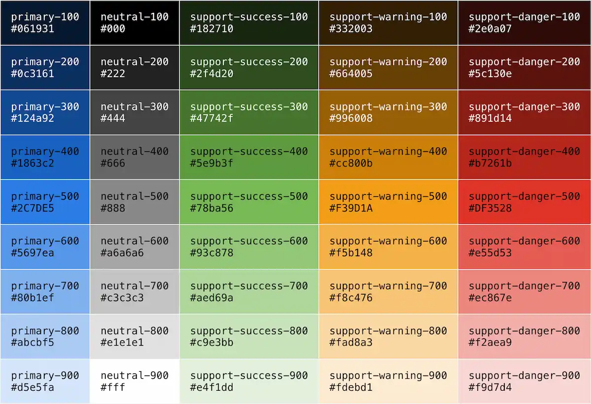
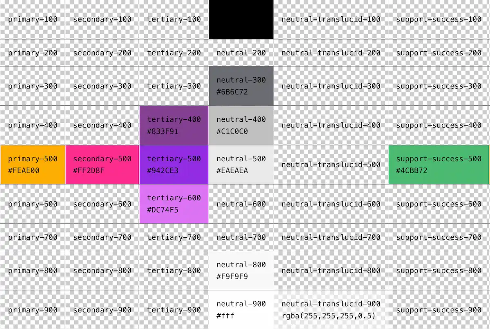

# Prérequis client

Voici la liste des spécifications que le client d'ITA doit retourner à l'équipe avant de commencer le développement&nbsp;:

## Couleurs

Le nombre de couleurs est illimité mais il doit respecter les règles suivantes&nbsp;: les couleurs s'organisent en familles, une famille de couleurs complète doit contenir 9 nuances de la plus sombre à la plus claire comme dans l'exemple ci-dessous. *Important&nbsp;: plus le nombre de familles de couleurs est élevé, plus les performances du framework sont impactées.*

La couleur principale de chaque famille est représentée par la **convention de désignation `<NOM_DE_LA_COULEUR>-500`**. Les valeurs abstraites `-400`, `-300`, `-200` et `-100` sont les nuances sombres de la couleur principale et les valeurs `-600`, `-700`, `-800` et `-900` sont des nuances plus claires.

* `<NOM_DE_LA_COULEUR>-100` nuance la plus sombre 
* `<NOM_DE_LA_COULEUR>-200` nuance sombre 
* `<NOM_DE_LA_COULEUR>-300` nuance sombre 
* `<NOM_DE_LA_COULEUR>-400` nuance sombre 
* **`<NOM_DE_LA_COULEUR>-500` couleur principale**
* `<NOM_DE_LA_COULEUR>-600` nuance claire
* `<NOM_DE_LA_COULEUR>-700` nuance claire 
* `<NOM_DE_LA_COULEUR>-800` nuance claire 
* `<NOM_DE_LA_COULEUR>-900` nuance la plus claire 

Exemple de table de couleurs valide

Exemple de table de couleurs invalides

## Espacements

Les espacements sont utilisés dans les marges, les positionnements ainsi que de nombreux composants, modifieurs et uttilitaires. Le nombre d'espacements **ne doit pas excéder 16**. *Important&nbsp;: plus le nombre d'espacements est élevé, plus les performances du framework sont impactées.*

Les espacements peuvent être fournis dans l'ordre croissant ou décroissant comme dans l'exemple ci-dessous.

* 112px
* 96px
* 80px
* 64px
* 56px
* 48px
* 40px
* 32px
* 24px
* 20px
* 16px
* 12px
* 8px
* 4px

## Polices de caractères

Une police de caractères est un ensemble de styles composé de 1 à 9 variations de graisses qui peuvent chacune être déclinées en italique. Une police de caractères peut donc regrouper 1 à 18 styles. 1 style = 1 graisse + italique oui ou non. Le nombre de polices de caractères est illimité, cependant *il est important de noter que plus le nombre de polices est élevé, plus les performances du framework sont impactées.* 

ITA demande la liste complète des polices de caractères utilisées. Par exemple&nbsp;:

* Montserrat Regular
* Montserrat Regular Italic
* Montserrat Medium
* Montserrat Bold
* Montserrat Black
* Open Sans Light
* Open Sans Light italic

## Tailles de texte

Affectations de la taille des éléments de type texte. **Le nombre de tailles de texte ne peut excéder 16. Important&nbsp;: plus le nombre de tailles de texte est élevé, plus les performances du framework sont impactées.**

Les tailles de texte peuvent être fournis dans l'ordre croissant ou décroissant comme dans l'exemple ci-dessous.

* 60px
* 54px
* 48px
* 42px
* 36px
* 32px
* 28px
* 24px
* 20px
* 18px
* 16px
* 14px
* 12px
* 10px
* 8px

## Bordures

Une bordure est définie par une épaisseur de trait, un type de trait et une couleur. **Le nombre de bordures ne peut excéder 16. Plus le nombre de bordures est élevé, plus les performances du framework sont impactées.**

Les bordures peuvent être nommées selon leur définition, `<EPAISSEUR>, <TYPE-TRAIT>, <COULEUR>` avec,

* **`<EPAISSEUR>`** en pixel, par exemple '1px',
* **`<TYPE-TRAIT>`** en toute lettres, par exemple 'dashed' (ou 'poitillé'),
* **`<TOKEN_COULEUR>`** le design token de la [couleur](#couleurs), par exemple 'primary-500'.

Elles peuvent-être fournies ordonnées selon leurs visibilités, comme dans l'exemple ci-dessous (de la moins visible à la plus visible).

* 1px, solid, transparent-800
* 1px, solid, transparent-500
* 1px, dashed, neutral-500
* 1px, solid, neutral-900
* 1px, solid, neutral-500
* 1px, solid, primary-500
* 1px, solid, support-success-500
* 1px, solid, support-warning-500
* 1px, solid, support-danger-500
* 1px, solid, neutral-200
* 2px, solid, neutral-900
* 2px, solid, neutral-500
* 2px, solid, neutral-200
* 3px, solid, neutral-500
* 3px, solid, primary-500
* 3px, double, neutral-500

## Coins arrondis

Un coin arrondi est défini par un ou deux rayons de courbure. Le nombre de coins arrondis n'est pas limité. **Le nombre de coins arrondis ne peut excéder 16. Cependant, plus le nombre de coins arrondis est élevé, plus les performances du framework sont impactées.**

Les coins arrondis sont à fournir comme décris sur [cette page](https://developer.mozilla.org/fr/docs/Web/CSS/border-top-left-radius).

Exemple de liste de coins arrondis à fournir :

* 100%
* 64px 10%
* 32px 20%
* 8px
* 4px

## Ombres portées ou Élévation

Les élévations se définissent comme décrites sur [cette page](https://developer.mozilla.org/fr/docs/Web/CSS/box-shadow). **Le nombre d'élévations ne peut excéder 16. Cependant, plus le nombre d'élévations est élevé, plus les performances du framework sont impactées.**

Les élévations sont nommées selon une **convention de désignation `<DECALAGE_HORIZONTAL> <DECALAGE_VERTICAL> <RAYON_DE_FLOU> <RAYON_D_ETALEMENT> <TOKEN_COULEUR>`**. 

* **`<DECALAGE_HORIZONTAL>`** décalage horizontal de l'ombre, par exemple 1px.
* **`<DECALAGE_VERTICAL>`** décalage vertical de l'ombre, par exemple 2px.
* **`<RAYON_DE_FLOU>`** rayon de flou de l'ombre, par exemple 10px.
* **`<RAYON_D_ETALEMENT>`** étalement de l'ombre, par exemple 0px.
* **`<TOKEN_COULEUR>`** le design token de la couleur.

Exemple de liste d'élévations à fournir :

* 5px 3px 12px 0px neutral-100
* 2px 2px 8px 0px neutral-100
* 1px 1px 5px 0px primary-500

## Médias

Les ressources vidéos et images présentes dans les maquettes doivent être transmises&nbsp;:

* Dans leur définition pleine, c'est-à-dire à 100% de la taille originale du fichier source.
* Pour les images ou les compositions statiques, dans un format non destructif tel que PNG Lossless, PSD, AI, TIF ou dans un format destructif JPG peu compressé.

## Icônes

Pour les icônes de l'interface, transmettre les fichiers vectoriels SVG à l'équipe de développement en veillant à respecter la [règle de conversion présente sur cette page](https://icomoon.io/#docs/stroke-to-fill).
